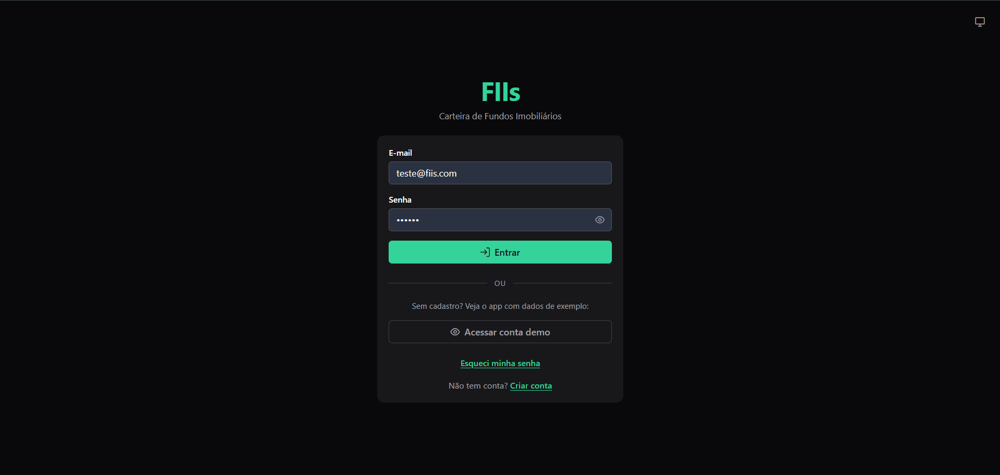
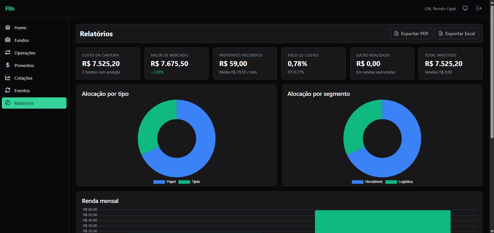
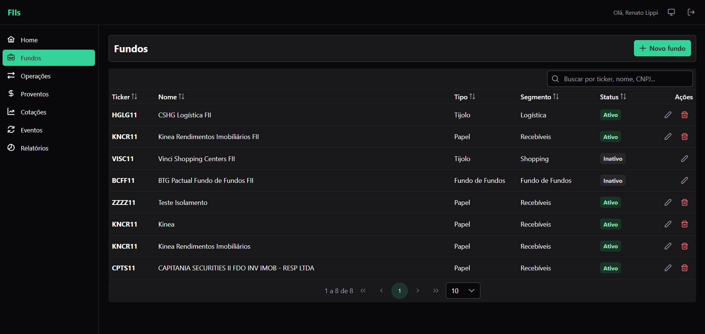

# FIIs — Gerenciador de Carteira de Fundos Imobiliários

[](https://fiis-web.vercel.app)
[](#)
[](#)
[](#)
[](#)
[](LICENSE)

Aplicação full-stack para acompanhar a carteira de **FIIs (Fundos de Investimento Imobiliário)** brasileiros: cadastro de fundos, registro de operações, controle de proventos, indicadores consolidados e exportação de relatórios em PDF/Excel.

## 🌐 Demo online

**Acesse:** https://fiis-web.vercel.app

Sem cadastro? Clique em **"Acessar conta demo"** na tela de login para entrar em uma conta pré-populada com 4 fundos, operações, proventos e cotações de exemplo.

> Credenciais públicas da conta demo: `demo@fiis.com` / `demo1234`

---

## ✨ Screenshots

| Tela de login | Dashboard de relatórios |
|:---:|:---:|
|  |  |

| Lista de fundos |
|:---:|
|  |

---

## 🛠️ Stack

| Camada | Tecnologias |
|---|---|
| **Backend** | Java 21 · Spring Boot 3.2 · Spring Security · JWT (access + refresh) · Spring Data JPA / Hibernate · Flyway · MapStruct · Bean Validation · Spring Mail · Thymeleaf · Caffeine · Resilience4j · Bucket4j · Micrometer / Prometheus · Apache POI · OpenPDF · Swagger / OpenAPI |
| **Frontend** | Angular 21 (standalone, signals, zoneless) · PrimeNG 21 (preset Aura) · Chart.js · SCSS · Vitest |
| **Banco** | PostgreSQL 16 |
| **Infra local** | Docker (PostgreSQL) |
| **Deploy** | Render (backend) · Vercel (frontend) · Supabase (PostgreSQL) |

---

## ✅ Funcionalidades

### Carteira
- 5 CRUDs completos: **Fundos**, **Operações** (compra/venda), **Proventos**, **Cotações**, **Eventos Corporativos** (bonificação, desdobramento, grupamento)
- **Multi-usuário** com signup público — cada conta tem carteira isolada
- **Importação automática de cotações** via [BRAPI](https://brapi.dev) (com Resilience4j: Retry + Circuit Breaker)
- **Job agendado** (`@Scheduled`) que atualiza cotações em dias úteis às 19h

### Relatórios
- **Dashboard** com 6 KPIs consolidados (custo, valor de mercado, proventos, yield, lucro realizado, total investido)
- Gráficos de **alocação por tipo** e **por segmento** (donuts)
- **Renda mensal** em barras + tabela "Top renda por fundo"
- **Exportação PDF** (relatório executivo de uma página) e **XLSX** (planilha analítica com totais)

### Segurança
- **JWT** com access token de 15min + refresh token de 7 dias rotacionado a cada uso
- **Reuse detection** — tentar reusar um refresh já consumido revoga toda a sessão do usuário
- **Senha forte** (mínimo 8 chars, letra + número), **rate limiting** em login/signup/forgot-password
- Fluxo de **"esqueci minha senha"** com email transacional (SMTP)

### UX
- **Tema** claro / escuro / sistema (persistido em `localStorage`)
- **Responsivo** desktop / tablet / mobile (cards empilhados em telas pequenas)
- **Skeletons** durante carregamentos
- Tratamento de erros centralizado com toasts traduzidos

### Observabilidade
- Endpoints **Actuator** (`health`, `info`, `metrics`, `prometheus`) — público / admin-only conforme sensibilidade
- **Métricas customizadas** Micrometer (operações criadas/atualizadas/excluídas, tempo de cálculo de posição, cache hit rate, importações BRAPI ok/falha)
- Trilha de **auditoria** estruturada via Spring Events (logfmt)

---

## 🚀 Como rodar localmente

### Pré-requisitos
- Java 21
- Maven 3.9+
- Node.js 20+
- Docker Desktop

### 1. Subir o PostgreSQL (Docker)

Primeira vez:

```bash
docker run -d --name fiis-postgres \
  -e POSTGRES_DB=fiis \
  -e POSTGRES_USER=renlip \
  -e POSTGRES_PASSWORD=fiis123 \
  -p 5432:5432 \
  -v fiis-postgres-data:/var/lib/postgresql/data \
  postgres:16-alpine
```

Próximas vezes:

```bash
docker start fiis-postgres
```

### 2. Backend (`fiis-api`)

```bash
cd fiis-api
mvn spring-boot:run
```

Disponível em `http://localhost:8081`. Swagger UI em [/swagger-ui/index.html](http://localhost:8081/swagger-ui/index.html).

> Para popular um usuário demo no startup: `FIIS_SEED_DEMO_ENABLED=true mvn spring-boot:run` (idempotente).
>
> Para criar um administrador: definir `FIIS_ADMIN_EMAIL` e `FIIS_ADMIN_PASSWORD` antes do `mvn spring-boot:run`.

Mais detalhes em [`fiis-api/README.md`](fiis-api/README.md).

### 3. Frontend (`fiis-web`)

Em outro terminal:

```bash
cd fiis-web
npm install     # primeira vez
npm start
```

Disponível em `http://localhost:4200`.

Mais detalhes em [`fiis-web/README.md`](fiis-web/README.md).

---

## 📁 Estrutura do projeto

```
fiis/
├── fiis-api/              # Backend Java + Spring Boot (Maven)
│   └── src/
│       ├── main/java/.../
│       │   ├── audit/         # Listeners de auditoria (Spring Events)
│       │   ├── config/        # @ConfigurationProperties + seed runners
│       │   ├── controller/    # Endpoints REST
│       │   ├── domain/        # entity, dto, vo, mapper, enumeration, event
│       │   ├── export/        # Geração de PDF (OpenPDF) e XLSX (POI)
│       │   ├── metrics/       # Listeners Micrometer
│       │   ├── repository/    # Spring Data JPA
│       │   ├── service/       # Regras de negócio
│       │   ├── support/       # Utilitários cross-cutting (BRAPI client, jobs, JWT)
│       │   └── validator/     # Validators customizados
│       └── main/resources/db/migration/   # Flyway (V1..V5)
│
├── fiis-web/              # Frontend Angular 21
│   └── src/app/
│       ├── core/          # services, guards, interceptors, models
│       ├── shared/        # layout, componentes reutilizáveis
│       └── features/      # domínios: auth, fundos, operacoes, ...
│
└── docs/screenshots/      # Capturas usadas neste README
```

---

## 📝 Convenção de commits

Este projeto segue [Conventional Commits](https://www.conventionalcommits.org/pt-br/):

| Prefixo | Quando usar |
|---|---|
| `feat(api):` / `feat(web):` | Nova funcionalidade |
| `fix:` | Correção de bug |
| `docs:` | Documentação |
| `chore:` | Configs, build, dependências |
| `refactor:` | Refatoração sem mudar comportamento |
| `test:` | Adição/ajuste de testes |

## 🌿 Git Flow

| Branch | Papel |
|---|---|
| `main` | Versões estáveis com tag |
| `develop` | Integração contínua — **default no GitHub**, dispara deploys (Render HML + Vercel) |
| `feature/*` | Trabalho em andamento — saem de `develop` e voltam por PR |

---

## 🗺️ Roadmap

- [ ] **#20** — Acessibilidade WCAG AA (contraste, foco visível, navegação por teclado)
- [ ] **#21** — Suíte de testes do frontend (Vitest)
- [ ] **#22** — Tag `v1.0.0` final e documentação de release

## 📄 Licença

[MIT](LICENSE) © 2026 Renato Lippi
